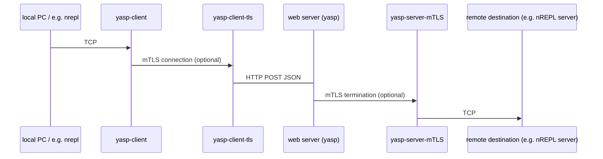

# yasp

Yasp and its companion yasp-client is proxy that does
TCP over HTTP, encoded as JSON.
It can also do mutual TLS termination.

Yasp requires that your Clojure web server can receive a HTTP POST JSON
request and produce a JSON response. 
The server component has only a single dependency: `clojure.tools.logging`.

## Overview

