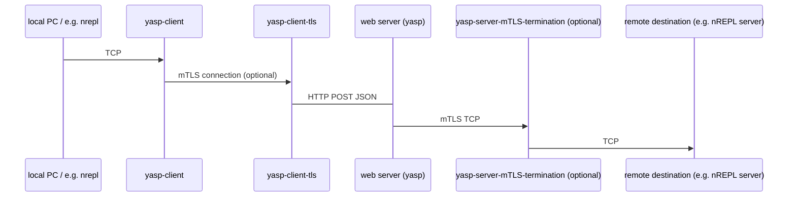

# yasp

Yasp and its companion yasp-client is proxy that does
TCP over HTTP, encoded as JSON.
It can also do mutual TLS termination.

Yasp requires that your Clojure web server can receive a HTTP POST JSON
request and produce a JSON response. 
The server component otherwise only has a single dependency: `clojure.tools.logging`.

## Overview



## Installation

Add 
```clojure
{:deps ...
       {com.github.ivarref/yasp {:...}}
 :aliases {...
           :generate-keys {:deps      {com.github.ivarref/locksmith {:mvn/version "0.1.6"}}
                           :exec-fn   com.github.ivarref.locksmith/write-certs!
                           :exec-args {:duration-days 365}}
           :proxy {:deps      {com.github.ivarref/yasp-client {:git/sha "..."}}
                   :exec-fn   com.github.ivarref.yasp-client/start-server!
                   :exec-args {:endpoint    "http://localhost:8080/proxy"
                               :remote-host "127.0.0.1"
                               :remote-port 7777
                               :local-port  8888
                               :tls-file    "client.keys"}}
           }}
```
to your `deps.edn` file.

## Usage

Add an endpoint to your exposed web server that forwards the data
to yasp:

```clojure

```
