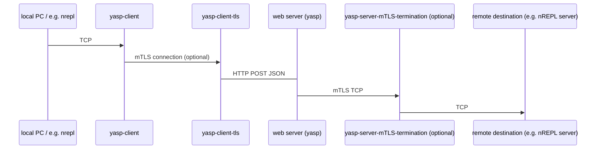

# yasp

Yasp and its companion yasp-client is proxy that does
TCP over HTTP(S), encoded as JSON.
It can also do mutual TLS termination.

Yasp requires that your Clojure web server can receive a HTTP POST JSON
request and produce a JSON response. 
The yasp server component otherwise only has a single dependency: `clojure.tools.logging`.

## Overview



## Examples

[aleph example](https://github.com/ivarref/yasp/tree/main/aleph-example).

## Installation

Add 
```clojure
{:deps {com.github.ivarref/yasp {:...}}
 :aliases {:generate-keys {:deps      {com.github.ivarref/locksmith {:mvn/version "0.1.6"}}
                           :exec-fn   com.github.ivarref.locksmith/write-certs!
                           :exec-args {:duration-days 365}}
           :proxy {:deps      {com.github.ivarref/yasp-client {:git/sha "..."}}
                   :exec-fn   com.github.ivarref.yasp-client/start-server!
                   :exec-args {:endpoint    "http://localhost:8080/proxy"
                               :remote-host "127.0.0.1"
                               :remote-port 7777
                               :local-port  8888
                               :tls-file    "client.keys"}}
           }}
```
to your `deps.edn` file.

## Usage

Add an endpoint to your exposed web server that forwards the data
to yasp. The example below is for pure for aleph using cheshire for json encoding/decoding:

```clojure
(defn handler [{:keys [uri body request-method]}]
  (cond
    (and (= "/proxy" uri) (= :post request-method) (instance? java.io.InputStream body))
    {:status  200
     :headers {"content-type" "application/json; charset=UTF-8"}
     :body    (cheshire.core/generate-string
                (com.github.ivarref.yasp/proxy!
                  {:allow-connect? (fn [{:keys [host port]}]
                                     (and (= host "127.0.0.1")
                                          (= port 22)))}
                  (cheshire.core/decode-stream
                    (java.io.InputStreamReader. ^java.io.InputStream body java.nio.charset.StandardCharsets/UTF_8)
                    keyword)))}

    (= "/proxy" uri)
    {:status  400
     :headers {"content-type" "application/json; charset=UTF-8"}
     :body    (cheshire.core/generate-string {:message "Bad Request"})}
    
    ...your other routes go here))

(defn start-server! []
  (http/start-server (fn [ctx] (handler ctx))
                     {:socket-address (InetSocketAddress. "127.0.0.1" 8080)})
  (println "HTTP Server running at http://127.0.0.1:8080"))
```

Verify that the endpoint works:
```bash
    # assuming your web server is running at 8080 and /proxy forwards to yasp.
    $ curl -X POST http://localhost:8080/proxy -H "Content-Type: application/json" -d '{"op" : "ping"}'
    {"res":"pong","tls":"disabled"}
    # `tls` will be either "valid", "invalid" (your config is broken) or "disabled".
```

## Development

Running tests:

```bash
    $ clojure -X:test

```
